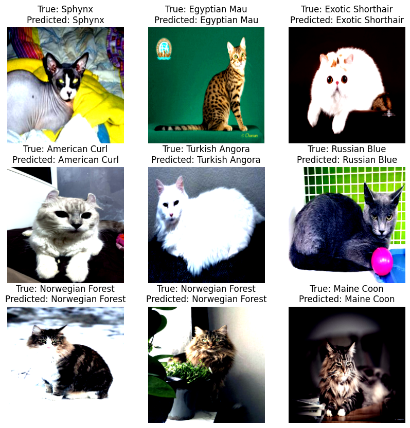

# CatBreeds_Classification
Training of VGG16 model for cat breeds classification.

## Dataset
[CatBreedsRefined-7k](https://www.kaggle.com/datasets/doctrinek/catbreedsrefined-7k/code)

## Example output of the test step:

